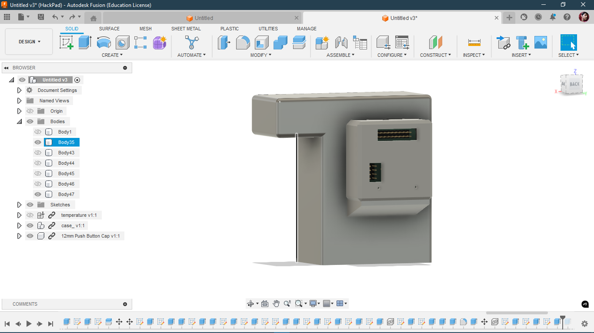
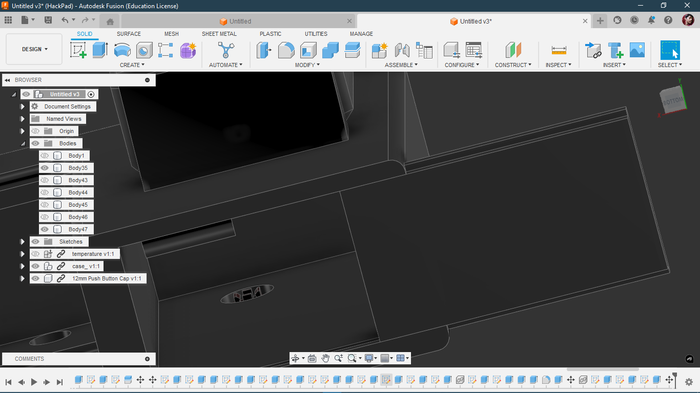
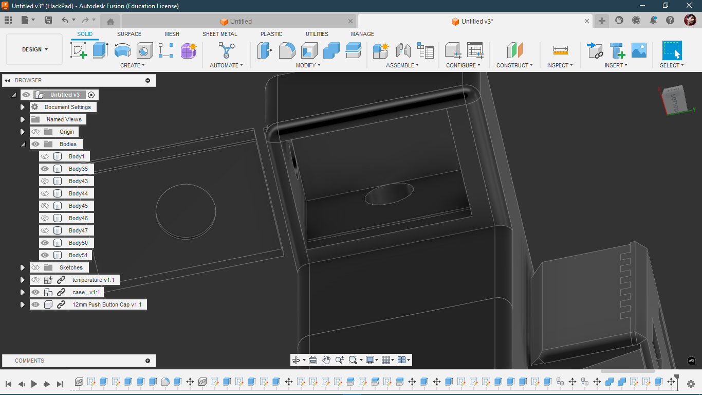
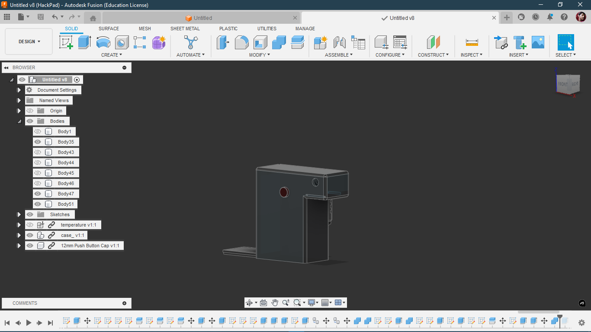
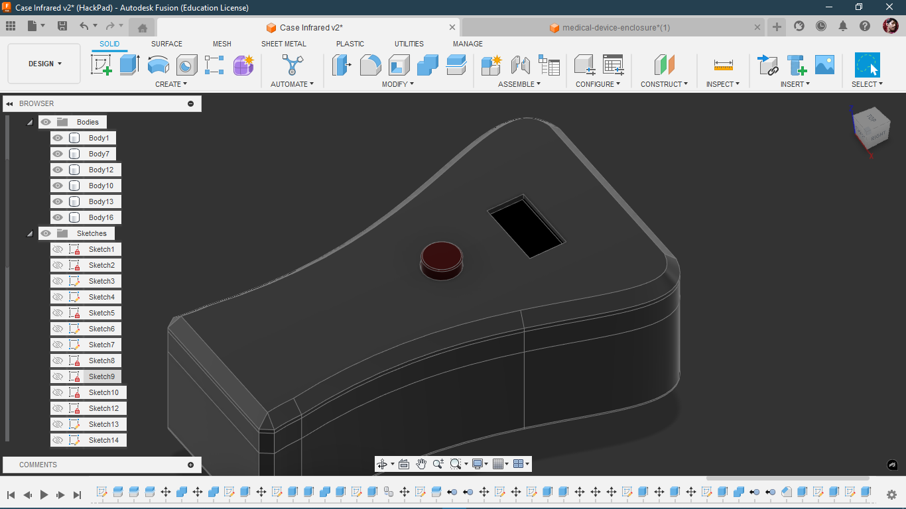

###
# TOTAL TIME TAKEN: 25Hrs
###
## Day - 1 (3 hrs)  
I read about STM32s and found out the Blue Pill (STM32F103C8) was best for me.  
Started checking its datasheet and listing required components.

## Day - 2 (2.5 hrs)  
Checked out various dev PCBs, collected data lol, and laid out components on the schematic... not finished duh.  
**Pic of the day**  

## Day - 3 (4 hrs)  
Finished making the schematic.  
Put in the correct capacitor values from the datasheet (also followed a sketchy schematic from Taobao).  
Will double-check everything before ordering dw...  
According to the datasheet, the capacitor value was 20pF, but I think that’s wrong — will verify later.  

## Day - 4 / P1 (1.2 hrs)  
Drew shapes for component placement and the overall PCB outline.  
Sketched the 2D layout of the temperature gun.  
Also planning to add a clock/timer on the dock with a USB-C port and a microcontroller (preferably with Wi-Fi — not a must though lol).  

## Day - 4 / P2 (1 hr)  
Here’s the PCB after layout and placement.  

## Day - 4 / P3 (4 hrs)  
After long hours of work...  
**FINALLY FINISHED — HECK YEAH!**  

---

## More Pics  
  
  
  
  
  

---

## Day - 5 (4 hrs)  
**Case done!**  

The brain will go at the back like this:  

I also made the bottom plate so the battery doesn't wobble and stuff.  

**Sliding mechanism here too!**  

**FINAL PIC**  

---

## Day - 5 (4 hrs, continued)  
The last case wasn’t that good,  
so I spent 4ish hours and came up with this:  

I took inspo from:  
[Medical Device Enclosure on GrabCAD](https://grabcad.com/library/medical-device-enclosure-made-with-freecad-1)

I’ve also added the files in `./CAD`.  
With this, I mark the end of this project.

## Day - 5 (1 hr)  
Made this animation so people can see it properly:

