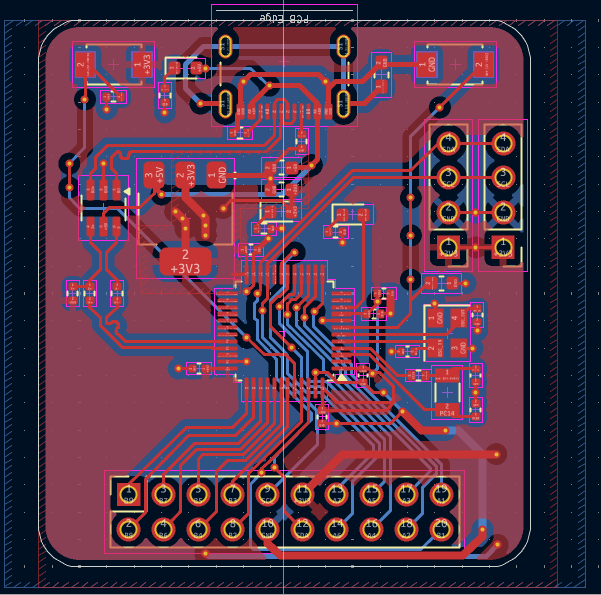

* Day - 1 (3.5hrs)
I read about the smt 32's and found out the blue pill was best for me (stm32f103c8)
and started checking its data sheet and listing required components.
* Day - 2 (2.5hrs)
Checked on varios dev pcbs collected data lol, and layed out the components not done ofc 
pic of da day

* Day - 3 (4hrs)
Finished making the shcmeatic
Put the right values capacitor said in Datasheet (followed some shetchy schmatic from taobao)
I will later check everything before ordering dw..
Acc to the datasheet the capacitor value was given 20pF but i think thats wrong i will check on that later tho..

* Day - 4/P1 (1.2Hrs)
I drew shapes for the placement of parts on the pcb and shape for pcb and scew the 2d image of the temperature gun also i will add a time/clock thingy on the dock with a usb c type port microcontroller with wifi preferebly/without also works lol.
 
* Day 4/P2 (1hrs)
Here is a pcb 

* Day 4/P3 (6hrs)
After long hours or work 
FINALLY FINISHED HECK YEAH

* MORE PICS

* Day 5(4hr)
Case done 

The brain will go at back like this 

I have also made the botton plae so the battery doesnt wobble and shi

SLIDING MECH HERER TOO

FINAL PIC
