* Day - 1 (3hrs)  
I read about STM32s and found out the Blue Pill (STM32F103C8) was best for me.  
Started checking its datasheet and listing required components.

* Day - 2 (2.5hrs)  
Checked out various dev PCBs, collected data lol, and laid out components on schematic... not finished duh.  
**Pic of the day**  
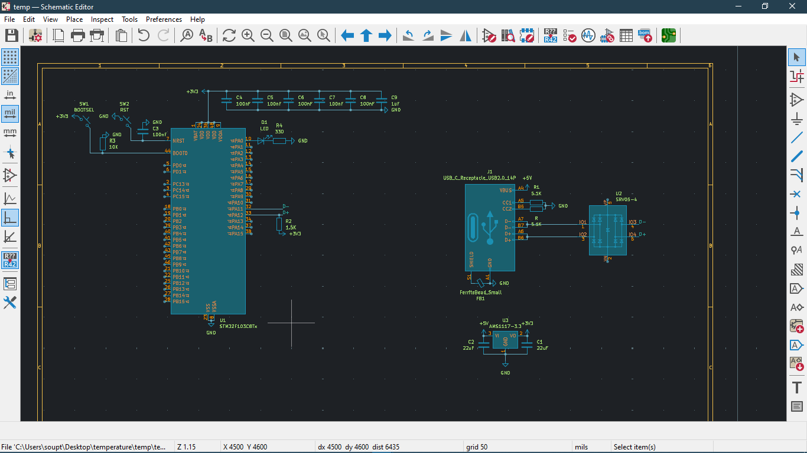

* Day - 3 (4hrs)  
Finished making the schematic.  
Put in the correct capacitor values from the datasheet (also followed a sketchy schematic from Taobao).  
Will double-check everything before ordering dw...  
According to the datasheet, the capacitor value was 20pF, but I think that’s wrong — will verify later.  

* Day - 4/P1 (1.2hrs)  
Drew shapes for component placement and the overall PCB outline.  
Sketched the 2D layout of the temperature gun.  
Also planning to add a clock/timer on the dock with a USB-C port and a microcontroller (preferably with Wi-Fi — not a must though lol).  
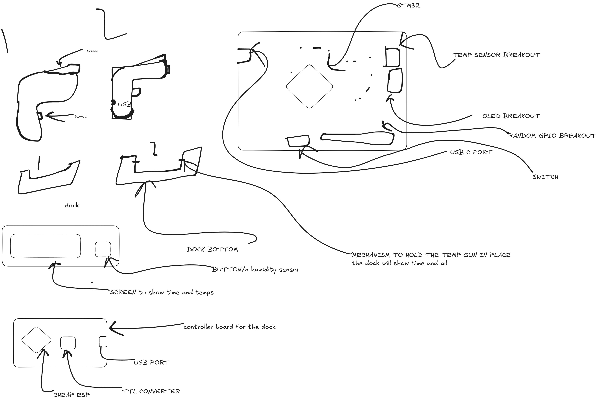

* Day 4/P2 (1hr)  
Here’s the PCB after layout and placement.  
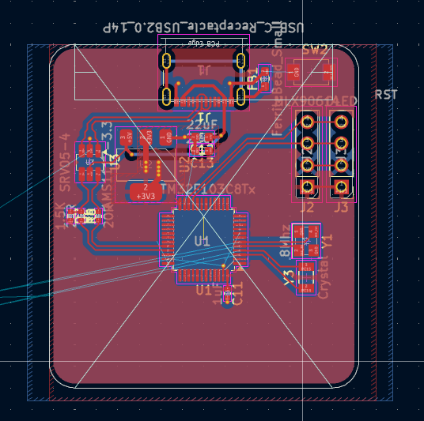

* Day 4/P3 (4hrs)  
After long hours of work...  
**FINALLY FINISHED — HECK YEAH!**  
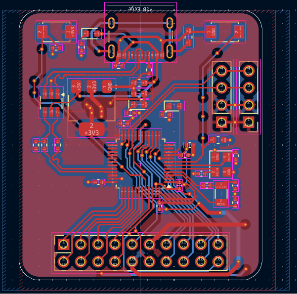

# MORE PICS  
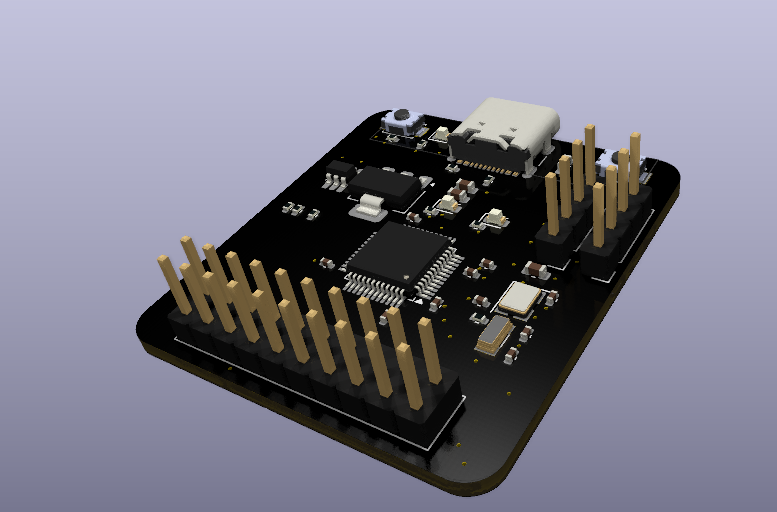
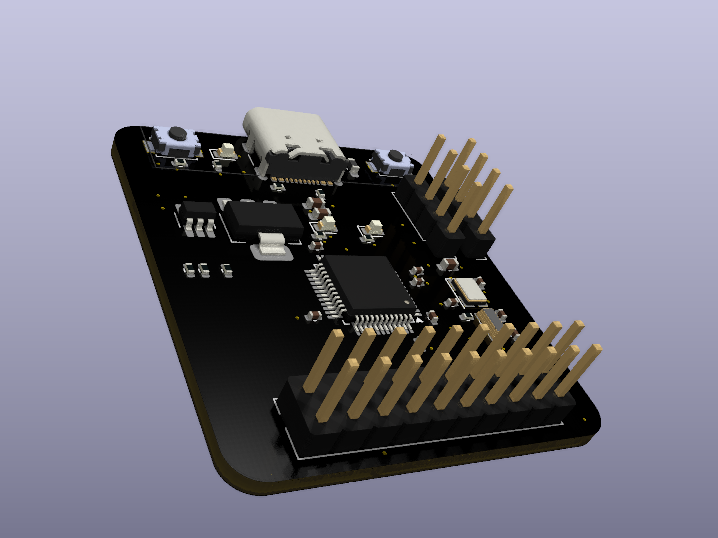
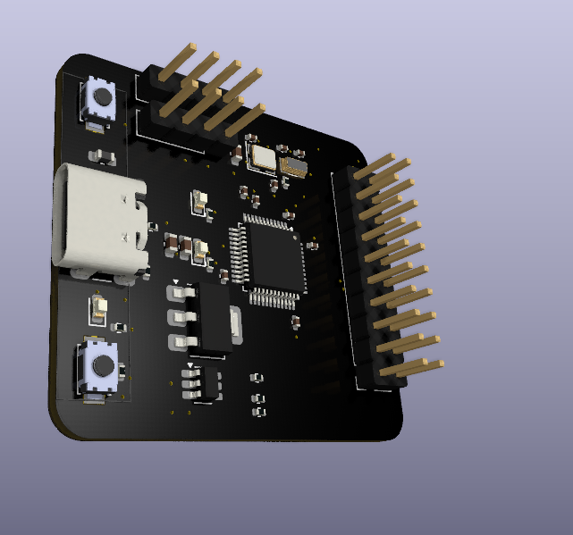
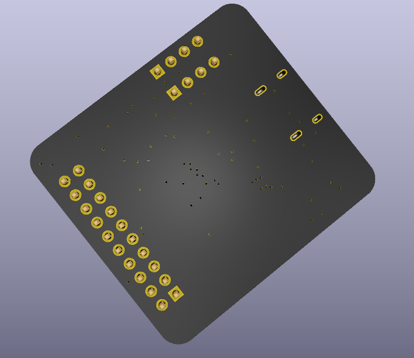
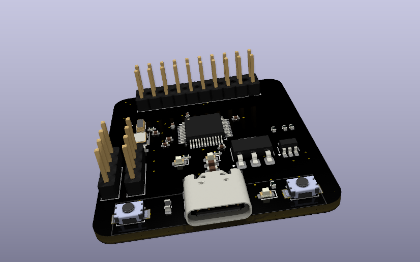
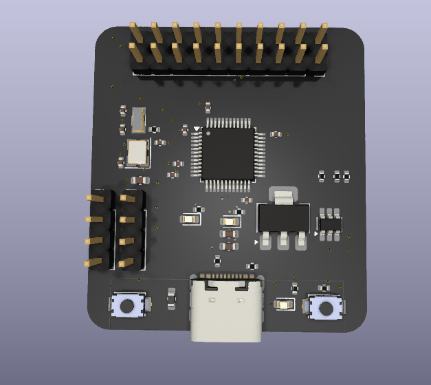

* Day 5 (4hrs)  
**Case done!**  
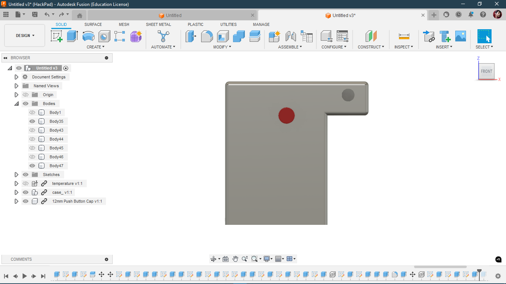

The brain will go at the back like this:  
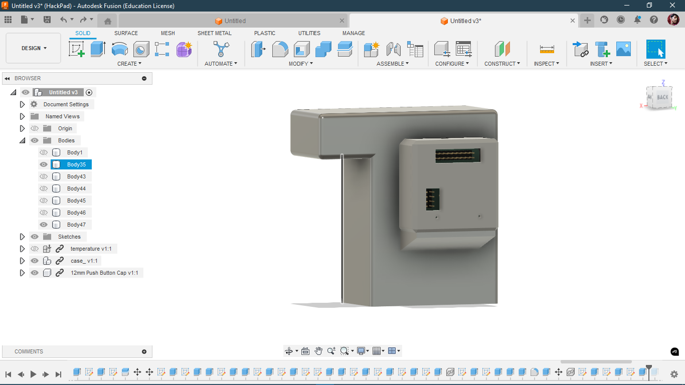

I also made the bottom plate so the battery doesn't wobble and stuff.  
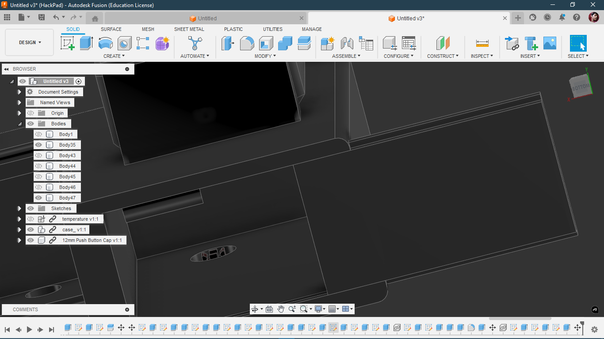

**Sliding mechanism here too!**  
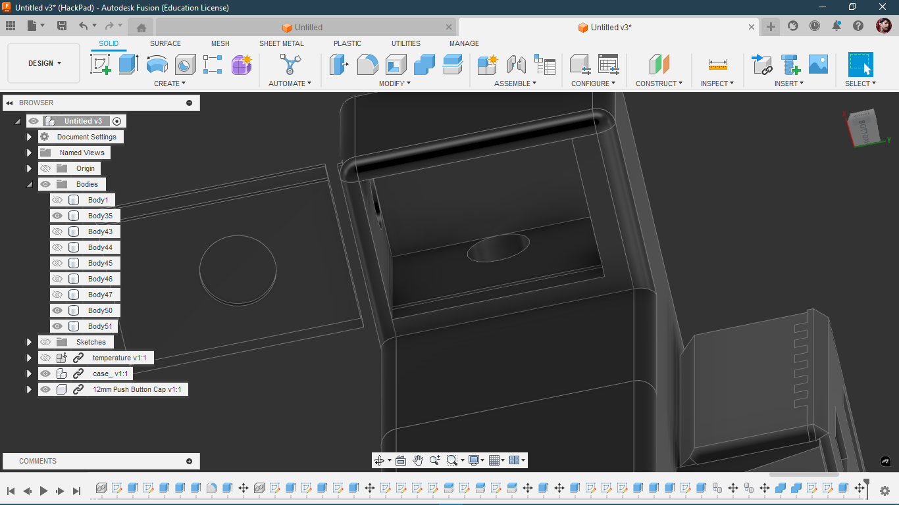

**FINAL PIC**  
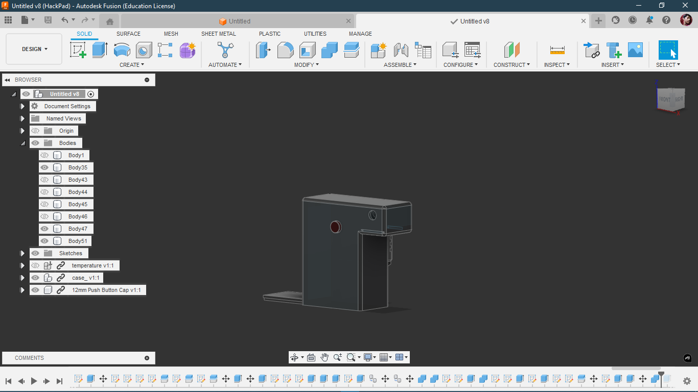
