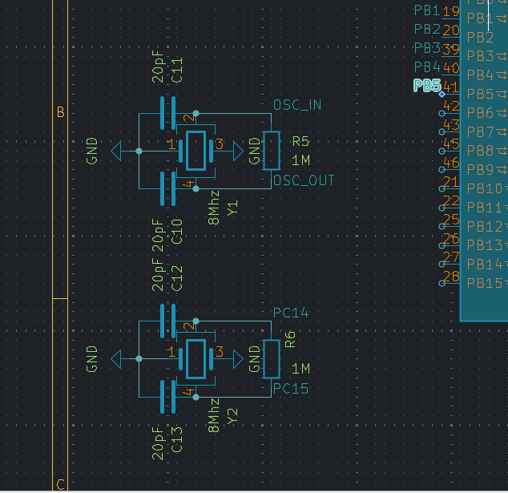
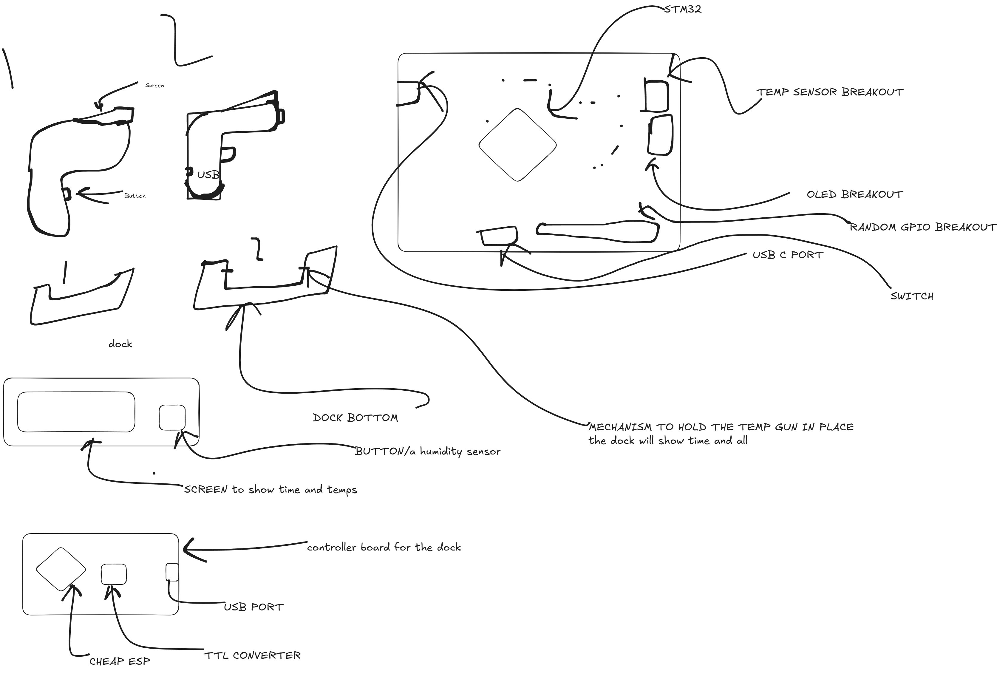

* Day - 1 (3.5hrs)
I read about the smt 32's and found out the blue pill was best for me (stm32f103c8)
and started checking its data sheet and listing required components.
* Day - 2 (2.5hrs)
Checked on varios dev pcbs collected data lol, and layed out the components not done ofc 
pic of da day

* Day - 3 (4hrs)
Finished making the shcmeatic
Put the right values capacitor said in Datasheet (followed some shetchy schmatic from taobao)
I will later check everything before ordering dw..
Acc to the datasheet the capacitor value was given 20pF but i think thats wrong i will check on that later tho..

* Day - 4 (1.2Hrs)
I drew shapes for the placement of parts on the pcb and shape for pcb and scew the 2d image of the temperature gun also i will add a time/clock thingy on the dock with a usb c type port microcontroller with wifi preferebly/without also works lol.
 