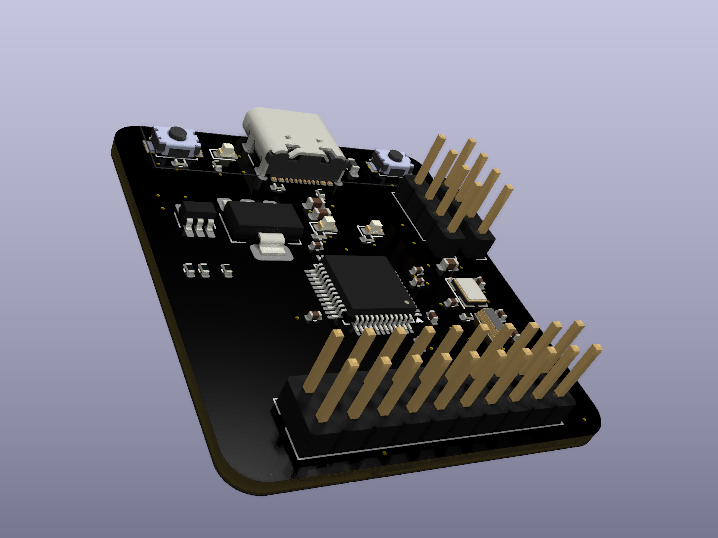
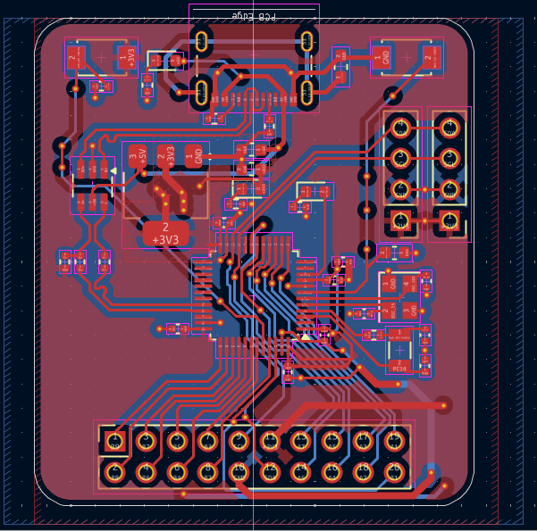

# Infrared Gun 
A non-contact temperature meter made by [@souptik-samanta](https://github.com/souptik-samanta/)

---

## Features
- Custom 3D-printed **Case**
- Based on **STM32F103C8** microcontroller
- Breakout for many **GPIO pins**
- **USB-C** interface
- **RTC** (Real-Time Clock) capabilities
- Embedded microcontroller; low power consumption

### About the STM32F103C8
The **STMicroelectronics STM32F103C8** is an ARM Cortex-M3 32-bit microcontroller:
- 72MHz
- 64kB Flash, 20kB SRAM
- Internal 8MHz RC + 32kHz LSE
- RTC, Power saving modes
- JTAG + SWD debug
- 3 synchronous serial interfaces

---

## Why STM32 and not Arduino?
- More powerful and **cheaper**
- **Tough** and industrial-grade (like me )
- More GPIOs, fewer passives
- Doesn’t need a bloated dev board like the RP2040 or ATmega

### PCB Preview:

---

## Cost Breakdown

| Item                        | Cost (USD)  |
|-----------------------------|-------------|
| 5× PCBs (JLCPCB)            | $20         |
| Component parts             | $40         |
| Parts shipping              | $10         |
| Case shipping (Hack Club)  | $10         |
| **Total**                   | **~$80**    |

[Full BOM (Google Sheets)](https://docs.google.com/spreadsheets/d/1CJmj2ZeR5zD6k4xkK5MPgWyc9Sze1-qekb7O28ZE8Ps/edit?usp=sharing)

---

## 🎞️ Exploded View Animation ()

 

---

