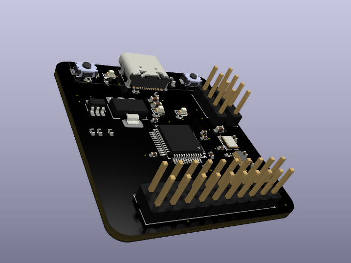
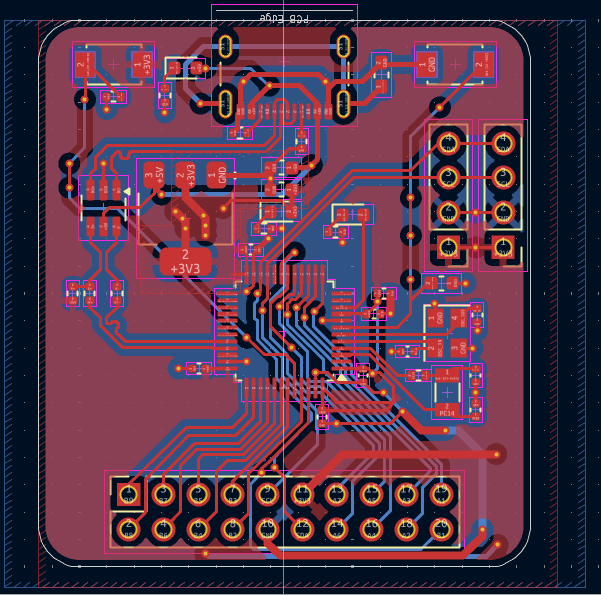
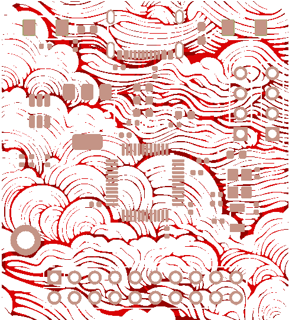
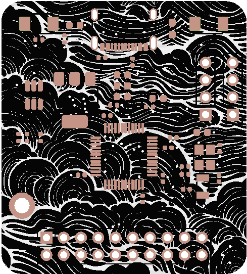
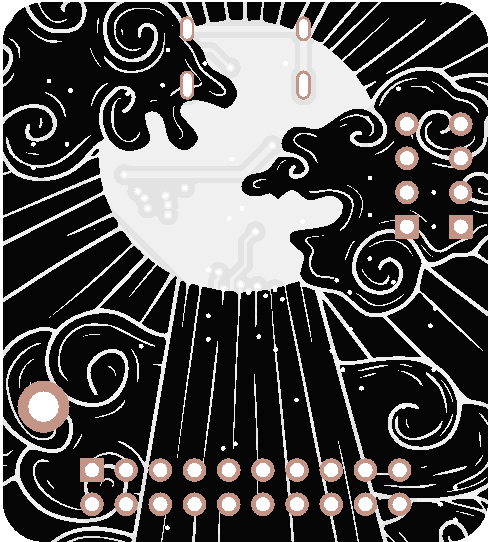

# Infrared Gun 
A non-contact temperature meter made by [@souptik-samanta](https://github.com/souptik-samanta/)

---

## Features
- Custom 3D-printed **Case**
- Based on **STM32F103C8** microcontroller
- Breakout for many **GPIO pins**
- **USB-C** interface
- **RTC** (Real-Time Clock) capabilities
- Embedded microcontroller; low power consumption

### About the STM32F103C8
The **STMicroelectronics STM32F103C8** is an ARM Cortex-M3 32-bit microcontroller:
- 72MHz
- 64kB Flash, 20kB SRAM
- Internal 8MHz RC + 32kHz LSE
- RTC, Power saving modes
- JTAG + SWD debug
- 3 synchronous serial interfaces

---

## Why STM32 and not Arduino?
- More powerful and **cheaper**
- **Tough** and industrial-grade (like me )
- More GPIOs, fewer passives
- Doesn’t need a bloated dev board like the RP2040 or ATmega

### PCB Preview:

---

## Cost Breakdown

| Item                        | Cost (USD)  |
|-----------------------------|-------------|
| 5× PCBs (JLCPCB)            | $20         |
| Component parts             | $60         |
| Parts shipping              | $10         |
| Case shipping (Hack Club)  | $10         |
| **Total**                   | **~$100**    |

### EXPANDEDAdd commentMore actions
| Designator           | Footprint                                                       | Qty | Value              | LCSC Part # | Price ($) | Notes                      |
|----------------------|------------------------------------------------------------------|-----|---------------------|-------------|-----------|----------------------------|
| C1, C2, C3, C4       | 0402                                                             | 4   | 20pF               |             | 0.11      | Total: 49.55              |
| C10, C6, C7, C8, C9  | 0402                                                             | 5   | 100nF              |             | 0.32      | Shipping: $10             |
| C11                  | 0402                                                             | 1   | 1uF                |             | 0.24      | SO: $58, CSAE: $10        |
| C12, C13             | 0603                                                             | 2   | 22uF               |             | 3.63      | SO: $70                   |
| C5                   | 0603                                                             | 1   | 100nF              |             | 0.25      | PCB Shipping: $20         |
| D1, D2, D3           | 0603                                                             | 3   | LED                |             | 0.50      | SO: $100                   |
| FB1                  | 0603                                                             | 1   | FerriteBead_Small  |             | 0.70      | And misc costs            |
| J1                   | USB_C_Receptacle_GCT_USB4105-xx-A_16P_TopMnt_Horizontal         | 1   | USB_C_Receptacle   |             | 0.90      | Note: Price may increase  |
| J2                   | PinHeader_1x04_P2.54mm_Vertical                                 | 1   | MLX90614           |             | 15.00     |                            |
| J3                   | PinHeader_1x04_P2.54mm_Vertical                                 | 1   | OLED               |             | 3.00      |                            |
| OLED-Extra           | I2C Display Module                                               | 1   | OLED Display        |             | 2.00      |           |
| J5                   | PinSocket_2x10_P2.54mm_Vertical                                 | 1   | Conn_02x10         |             | 5.00      | Final Total: $98          |
| R1                   | 0402                                                             | 1   | 10K                |             | 0.30      |                            |
| R10, R11, R4         | 0402                                                             | 3   | 330                |             | 0.50      |                            |
| R3                   | 0402                                                             | 1   | 0                  |             | 1.00      |                            |
| R5, R6               | 0402                                                             | 2   | 20R                |             | 0.50      |                            |
| R7                   | 0402                                                             | 1   | 1.5K               |             | 0.70      |                            |
| R8, R9               | 0402                                                             | 2   | 5.1K               |             | 0.90      |                            |
| SW1                  | SW_TS-1088-AR02016                                               | 1   | BOOTSEL            |             | 1.00      |                            |
| SW2                  | SW_TS-1088-AR02016                                               | 1   | RST                |             | 1.00      |                            |
| U1                   | LQFP-48_7x7mm_P0.5mm                                             | 1   | STM32F103C8Tx      |             | 8.00      |                            |
| U2                   | SOT-223-3_TabPin2                                                | 1   | AMS1117-3.3        |             | 1.00      |                            |
| U3                   | SOT-23-6_Handsoldering                                           | 1   | SRV05-4            |             | 1.00      |                            |
| Y1                   | Crystal_SMD_3225-4Pin_3.2x2.5mm                                  | 1   | 8MHz               |             | 0.80      |                            |
| Y3                   | Crystal_SMD_3215-2Pin_3.2x1.5mm                                  | 1   | 32.768            |             | 1.20      |                            |
battries from burger 5$$
###

[Full BOM (Google Sheets)](https://docs.google.com/spreadsheets/d/1CJmj2ZeR5zD6k4xkK5MPgWyc9Sze1-qekb7O28ZE8Ps/edit?usp=sharing)

---

## 🎞️ Disintregreted View Animation(Wait for sometime)

 

## JLCPCB RENDER

###

.png>)

###

###

###

###

###

###

###
---

